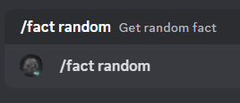
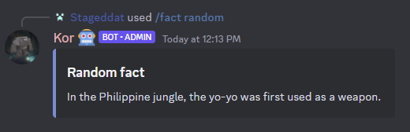
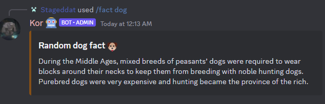
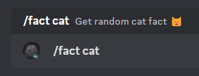
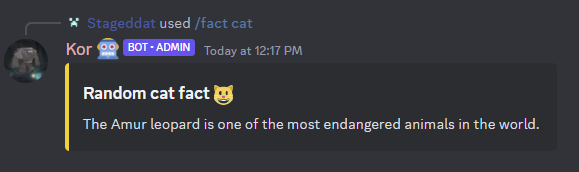
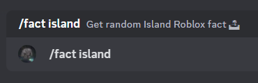
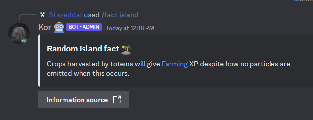

# Wiki Commands

Wiki Index

- [Home](home.md)
- Commands
- Config
- Troubleshooting
  - Facts sync
- Protocol and guide
  - Facts
    - Adding facts
    - Adding facts from Trivia of Roblox [Island wiki website](https://robloxislands.fandom.com/wiki/Islands_Wiki)
    - Change current number
    - egg
  - Welcome
    - Test welcome message with specific user

## Wait a min...
The following wiki is separating the commands of different classes and sub-classes.
 You can use the index command to go to the one you like

### Facts
  - Facts public commands
    - `/fact random` - Get a random fact
        

          
Example

           
          
        

    - `/fact dog` - Get a random dog fact
      

        
Example

         
        
      

    - `/fact cat` - Get a random cat fact
      

        
Example

         
        
      

    - `/fact island` - Get a random Roblox Island fact
      

        
Example

         
        
      
